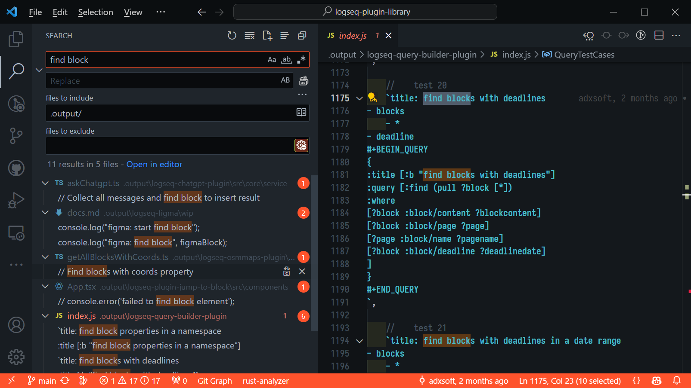

This tool will iterate over all of the plugin manifests found at https://github.com/logseq/marketplace and
clone the repositories they refer to, locally. If the repositories have already been cloned, they will be updated.

# Motivation

Here's a motivating screenshot, to illustrate the use of this:



I am searching the source code for every logseq plugin that is published on the marketplace for "find block". This will find
code usage and comments matching this phrase. I can then look through these results to get an idea on how to tackle whatever my
partiular problem about "finding blocks" is, with the benefit of seeing how others have solved similar problems. 

I think it's a fantastic way to leverage open source to make more open source, personally!

# Installation

Until I can learn how to use GitHub actions to produce release binaries, you'll have to compile your own. Luckily this is usually very easy to do with rust.

1. Install [Rust](https://www.rust-lang.org/tools/install)
2. Clone this repo
3. Run `cargo build --release` in the working directory of the repo to create release binaries for the project

# Usage
```
Usage: logseq-plugin-collector.exe [OPTIONS] --destination <DESTINATION>

Options:
  -d, --destination <DESTINATION>  The destination (directory) to write the output to
  -c, --create-destination         If true, the destination will be created if not found
  -h, --help                       Print help
  -V, --version                    Print version
```


# Disk Space Requirements

As of this writing, the complete cloned set of all logseq marketplace plugins takes up approximately 3.6 GB.
